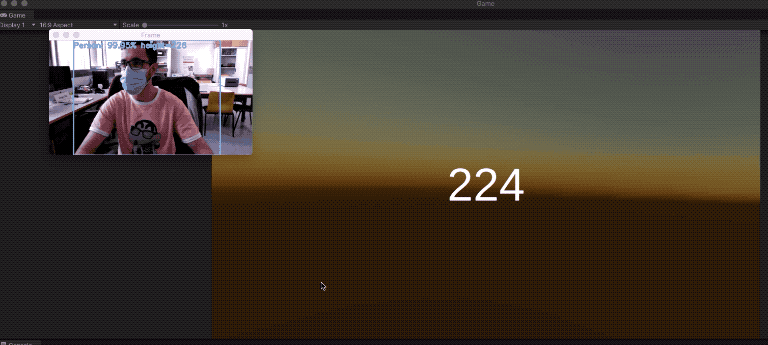

# Realtime *closest* person detection <-> MongoDB

This project is a demo that performs a detection of the *closest* person in a real-time video. The calculation chosen to evaluate who is closer to the camera is the person's height (Change the calculation to your context of use). A value of -1 means that no person is detected.

This value is written to a MongoDB collection evey frame (given by OpenCV).

This project also contains code with a simple Flask app to make requests to obtain the value

## Installation

1. Pull the code
2. Create a python environment (*e.g.* Virtualenv), activate it and install de requirements

*e.g.* 

`virtualenv -p python3 .venv`

`source .venv/bin/activate`

`pip install -r requirements.txt`

3. Install MongoDB on your machine and run it as a service (*e.g.* through Homebrew on macOS)

*e.g.* With Homebrew

`brew services start mongodb-community@4.4`

4. Check that everything works by executing the `mongo` command

5. Since the code in this project works with specific collections, either create them or modify the code (and create them as well)

*e.g.* Inside the `mongo` environment, execute

`use ssexpo`

`db.data`

`db.data.insertOne({"description":"User proximity value", "value":100000})`

`db.data.find()`

These commands create the DB, the collection, inserts the document we'll be working and retrieves all documents in the collection

6. Everyting installed!!

## Runnig the code

In this project, there are two separated parts, the person-detection part and the Flask part, so the steps I follow to 'run' the application are the following:

1. Make sure MongoDB is running as a service
2. Launch the flask server

`python flask_server.py`

If everything works, navigating to *http://127.0.0.1:5000/closest_person* on a browser should give you a numeric value (the value stored in MongoDB)

3. Launch the person detection script

`python detect_and_write_to_mongo.py
        --prototxt MobileNetSSD_deploy.prototxt.txt
        --model MobileNetSSD_deploy.caffemodel`

A small window should open, showing the input from your webcam

4. To validate that everything works, you can either refresh the web browser or perform commands through the `mongo` terminal

## Demo

This gif shows an example, retrieving the value from Unity

## Other scripts in the project

- mongo_test.py: A simple test I did to learn MongoEngine
- real_time_object_detection.py: If you run it, the model will detect all the object it's been trained for (saves nothing to MongoDB)
- real_time_people_detection.py: Only detects people (saves nothing to MongoDB)
- real_time_closest_person_detection.py: Filters to get the *closest* person (saves nothing to MongoDB)

## References
- Real time object detection tutorial: https://www.pyimagesearch.com/2017/09/18/real-time-object-detection-with-deep-learning-and-opencv/
- MongoDB Python tutorial: https://realpython.com/introduction-to-mongodb-and-python/
- MongoDB Community Edition installation: https://docs.mongodb.com/manual/administration/install-community/
- MongoEngine (MongoDB ORM for Python): https://docs.mongoengine.org/tutorial.html